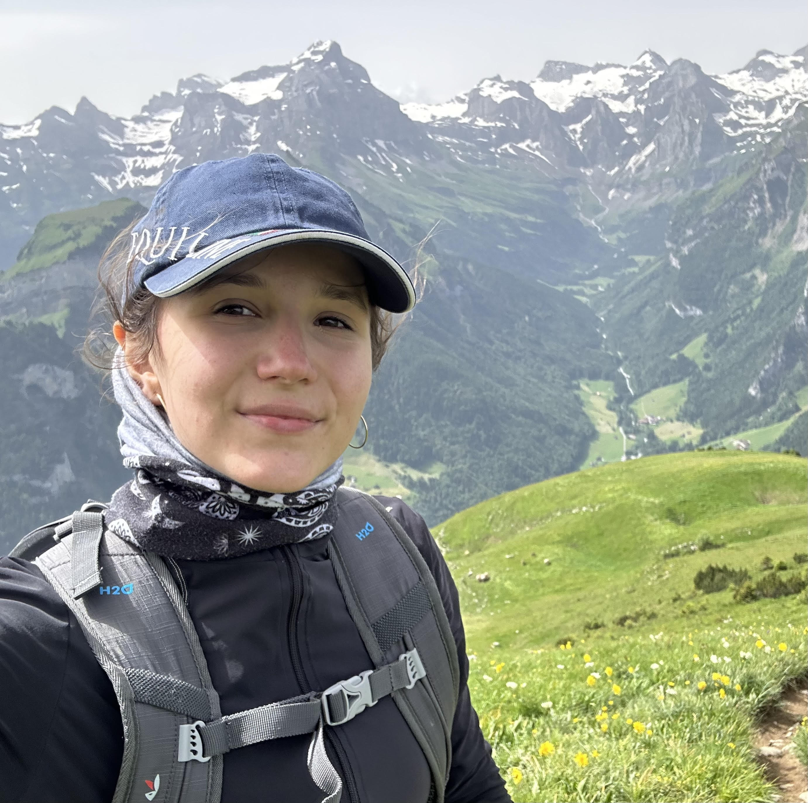

  

    
    

      
      
      

  

  

    <!-- <h3>About Me</h3> -->
    

    I’m currently pursuing a <b>Master’s degree in Artificial Intelligence at Charles University in Prague</b>, with a Bachelor's degree in Bioinformatics and a background in <b>Chemistry</b>. I started out in the lab, but through my work as a <b>computational chemist</b>, I discovered a passion for programming and data. Now I’m diving into <b>computer vision</b> in <b>nuclear research</b>, and slowly transitioning more into <b>informatics</b>. I love when <b>biology, chemistry, and machine learning</b> come together.
    

  

<!-- 
<h2>Recent Posts</h2>

<ul class="post-list">
  
  <li>
    {{ post.date | date: "%b %-d, %Y" }}
    <h3><a class="post-link" href="{{ post.url | relative_url }}">{{ post.title }}</a></h3>
    {{ post.excerpt }}
  </li>
  
</ul>

  <a href="/blog" class="button">View All Posts</a>

 -->